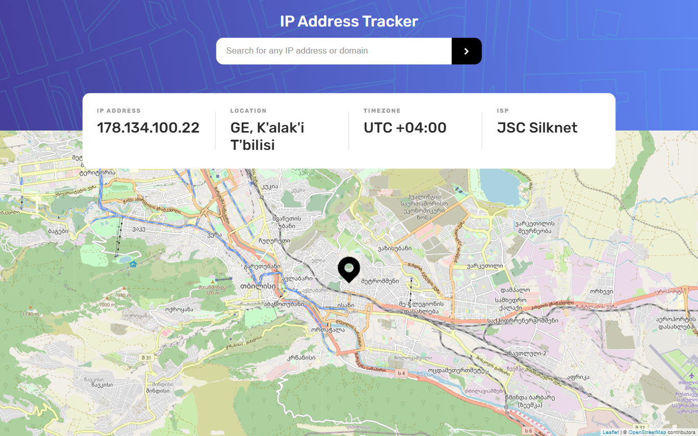

# Frontend Mentor - IP address tracker solution

This is a solution to the [IP address tracker challenge on Frontend Mentor](https://www.frontendmentor.io/challenges/ip-address-tracker-I8-0yYAH0). Frontend Mentor challenges help you improve your coding skills by building realistic projects.

## Table of contents

- [Overview](#overview)
  - [The challenge](#the-challenge)
  - [Screenshot](#screenshot)
  - [Links](#links)
- [My process](#my-process)
  - [Built with](#built-with)
  - [What I learned](#what-i-learned)
- [Author](#author)

## Overview

### The challenge

Users should be able to:

- View the optimal layout for each page depending on their device's screen size
- See hover states for all interactive elements on the page
- See their own IP address on the map on the initial page load
- Search for any IP addresses or domains and see the key information and location

### Screenshot

### Links

- Solution URL: https://www.frontendmentor.io/solutions/ip-address-tracker-react-typescript-scss-ipify-api-react-leaflet-DCSmdjZ-o
- Live Site URL: https://lukakobaidze-ipaddresstracker.netlify.app/

## My process

### Built with

- React
- TypeScript
- SCSS
- IP Geolocation API by IPify
- React Leaflet

### What I learned

I learned how to use React Leaflet and IP Geolocation API.

## Author

- Frontend Mentor - [@LukaKobaidze](https://www.frontendmentor.io/profile/LukaKobaidze)
- FreeCodeCamp - [@lukakobaidze](https://www.freecodecamp.org/lukakobaidze)
